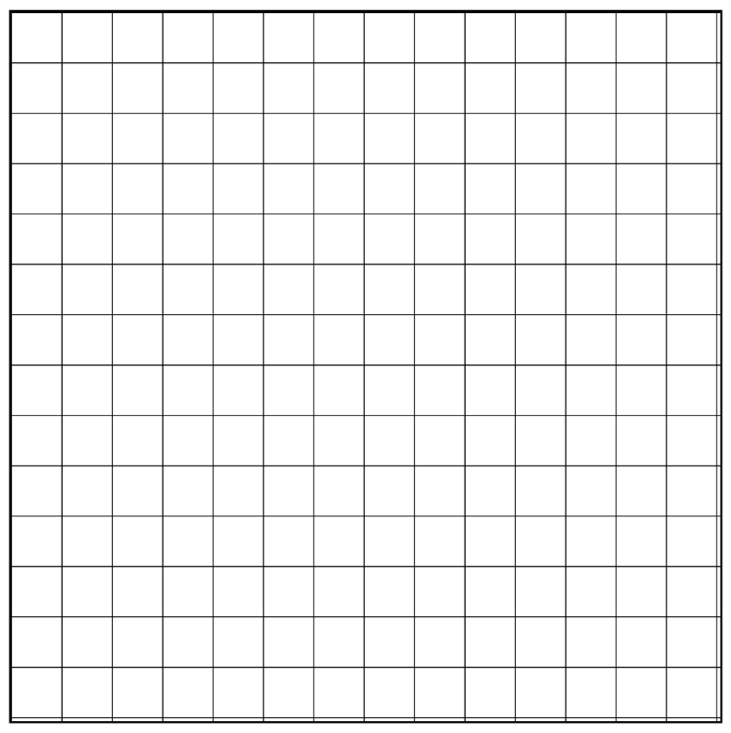

# Proyecto

Voy a hacer un "spike" con todas las cosas que quiero que mi juego tenga, la idea es pensar por ejemplo: 
- *Quiero un mundo por el que me pueda mover y que tenga recursos.
Pues para hacer eso pensare que necesito ya sea como hacer que se muestre solo una parte del mapa y que al moverme vaya apareciendo lo demas o como hacer que se dibujen esos recursos fijos en una coordenada y asi tendre una base de la cual partir con las cosas que se que funcionan y cumplen mis necesidades.*

## Mundo

#### Como hago que el mundo tenga un tamaño pero solo muestre una parte para dar esa sensacion de que estas en un mundo por el cual puedes moverte y encontrar cosas?

Vale, primeramente creo que lo que mas se adapta a lo que quiero es un "canvas" es un elemento de html que se usa para pintar graficos, para ello necesitas tambien JavaScript que es el encargado de pintar las cosas que quieres.

1. Primero creo el canvas con **`<canvas></canvas>`**
2. Y le doy los parametros necesarios para empezar a configurarlo con JavaScript (importante el ID y declarar el width y el height si no pondra los default que es 300x150).

**Quedaria asi:**
```html
<canvas id="world" height="400" width="800"></canvas>
```

***Importante declarar el width y el height en el elemento `<canvas>` porque si lo haces con CSS dara problemas ha sido uno de los primeros errores que me he encontrado

Ahora hay varias cosas que serian interesantes implementar para que el mundo tenga mas sentido que un rectangulo en blanco. Por ejemplo empezaria por hacer que el mundo tenga un grid basicamente recuadros de una medida fija como un tablero de ajedrez que ayudaran a diferenciar las partes del mapa ya que moverte en un fondo blanco digamos que es como si no hicieras nada, despues estaria bien pintar cuadrados o cualquier figura sencilla que demomento seran las menas de recursos o arboles por ejemplo y como ultimo habria que hacer que nos podamos mover por el mundo que hemos creado asi que vamos paso por paso:

### Cuadricula del mundo (Grid)

Vale para empezar tendriamos que hacer la configuracion inicial del canvas como ya he dicho antes y a partir de ahi seguiremos con JavaScript:

```html
<canvas id="world" height="500" width="500"></canvas>
```

Ahora no veremos nada porque el canvas esta en blanco por defecto, ahora pasamos con el JavaScript:

primero le damos los parametros iniciales para que identifique el canvas y entienda que queremos que pinte cosas en 2D:
  
```html
<script>
  let world = document.getElementByID("world"); // Creamos el valor "world" que apunta al ID del canvas
  const ctx = world.getContext("2d"); // Le decimos que el contexto del canvas queremos que sea en 2D
</script>
```

Con esta funcion que vamos hacer lo que conseguimos es ya crear nuestra primer cuadricula, basicamente estamos diciendole desde donde queremos que dibuje las lineas, con que espacio y que tamaño con tal de que formemos una cuadricula en todo el canvas.

```javascript
function drawGrid(lineWidth, cellWidth, cellHeight, color) {
  // Propiedas de las lineas
  ctx.strokeStyle = color;
  ctx.lineWidth = lineWidth;

  // Obtener tamaño
  let width = world.width;
  let height = world.height;

  // Dibujar lineas verticales
  for (let x = 0; x <= width; x += cellWidth) {
    ctx.beginPath(); // Desde aqui se dibujara la linea
    ctx.moveTo(x, 0); // Movemos el punto de inicio al 0 en los ejes x y
    ctx.lineTo(x, height); // Nos quedamos en la x y vamos hasta donde le pongamos al valor "height"
    ctx.stroke(); // Con esto hacemos que cada vez que se dibuja una linea tenga la separacion que hemos puesto  en el valor "cellWidth"
  }

  // Dibujar lineas horizontales
  for (let y = 0; y <= height; y += cellHeight) {
    ctx.beginPath();
    ctx.moveTo(y, 0);
    ctx.lineTo(width, y);
    ctx.stroke();
  }
}
drawGrid(1, 20, 20, "#000");
```

Bueno una vez hemos hecho esto ya vemos nuestra primera cuadricula pero hay un problema, si te fijas por alguna razon las lineas se ven borrosas, eso se debe a que el elemento canvas de por si usa un ajuste de DPI (pixeles por pulgada) muy bajo que para pantallas antiguas seria perfecto pero hoy en dia las pantallas son mucho mas potentes. Lo que hacen las pantallas se llama Down Sampling y es lo que pasa cuando una pantalla con una resolucion mayor renderiza algo con unos graficos muy bajos, para solucionar eso hacemos esto.

```javascript
function accountForDPI() {
  const dpr = window.devicePixelRatio || 1; // Con esto conseguimos cuantos pixeles se dibujan por cada pixel fisico, si no se obtiene nada el valor sera 1
  const rect = world.getBoundingClientRect(); // Conseguimos el tamaño del canvas en CSS porque al parecer el tamaño que vemos puede ser diferente al registrado por CSS

// Con esto hacemos que el tamaño interno del canvas se adapte a el valor que obtengamos del dpr de cada pantalla
  world.width = rect.width * dpr;
  world.height = rect.height * dpr;
  ctx.scale(dpr, dpr);

// Ahora manteniendo el escalado para el dpr que toca le ponemos el tamaño real del canvas ya que sin esto se veria todo demasiado grande
  world.style.width = `${rect.width}px`;
  world.style.height = `${rect.height}px`;
}
accountForDPI();
```

Vale, he identificado 2 problemas que hacian que el grid no se dibujase correctamente.

Para empezar he cambiado el sitio donde estaba llamando a la funcion `drawGrid` haciendo que primero se llame a la funcion `accountForDPI` y luego se dibuje el grid con `drawGrid`. De esta forma conseguimos que si se dibuje el grid ya que antes no lo hacia porque por alguna razon si primero se pintaba logicamente consiguiendo el DPI y luego se pintaba fisicamente con la funcion `drawGrid` se quedaba en blanco

Luego me he dado cuenta que las lineas se veian como demasiado gruesas y algo borrosas, resulta que si tu pintas las lineas desde el 0 0 cada surge un problema matematico entre el canvas y tu monitor, si la instruccion es pinta una linea en la coordenada 10 10 si fuera por el canvas estaria bien pero el problema esta en que los monitores estan formados por pixeles que al final son "bombillitas" que se encienden y apagan pero no pueden encenderse a medias por lo tanto la logica que se aplica es pintar la linea en la coordenada 9.5 y en la 10.5 aplicando algo que se llama Anti-aliasing, hace que las 2 lineas que quieren formar 1 linea negra se pinten con un gris eso hace que sea mas gruesa y mas borrosa ya que no es negro puro. Con este cambio de contexto llamado `ctx.translate(0.5, 0.5);` conseguimos que todo se empieze a dibujar en el 0.5 asi cuando esta intentando pintar en la coordenada 10.5 lo que va a hacer es pintar desde la 10 a la 11 y de esta forma no se ve borroso porque son 100% negras y estan en el mismo, antes se pintaban a cada lado de la linea divisoria invisible que existe y eso generaba ese problema.

**El codigo demomento quedaria asi:**

```javascript
<script>
  let world = document.getElementById("world"); // Creamos el valor "world" que apunta al ID del canvas
  const ctx = world.getContext("2d"); // Le decimos que el contexto del canvas queremos que sea en 2D

  function drawGrid(lineWidth, cellWidth, cellHeight, color) {
  // Propiedas de las lineas
  ctx.strokeStyle = color;
  ctx.lineWidth = lineWidth;

  // Obtener tamaño
  let width = world.width;
  let height = world.height;

  // Dibujar lineas verticales
  for (let x = 0; x <= width; x += cellWidth) {
    ctx.beginPath(); // Desde aqui se dibujara la linea
    ctx.moveTo(x, 0); // Movemos el punto de inicio al 0 en los ejes x y
    ctx.lineTo(x, height); // Nos quedamos en la x y vamos hasta donde le pongamos al valor "height"
    ctx.stroke(); // Con esto hacemos que cada vez que se dibuja una linea tenga la separacion que hemos puesto  en el valor "cellWidth"
  }

  // Dibujar lineas horizontales
  for (let y = 0; y <= height; y += cellHeight) {
    ctx.beginPath();
    ctx.moveTo(0, y);
    ctx.lineTo(width, y);
    ctx.stroke();
  }
}
// Antiguamente aqui estaba la funcion drawGrid que daba problemas
function accountForDPI() {
  const dpr = window.devicePixelRatio || 1; // Con esto conseguimos cuantos pixeles se dibujan por cada pixel fisico, si no se obtiene nada el valor sera 1
  const rect = world.getBoundingClientRect(); // Conseguimos el tamaño del canvas en CSS porque al parecer el tamaño que vemos puede ser diferente al registrado por CSS

// Con esto hacemos que el tamaño interno del canvas se adapte a el valor que obtengamos del dpr de cada pantalla
  world.width = rect.width * dpr;
  world.height = rect.height * dpr;

  ctx.scale(dpr, dpr);

  ctx.translate(0.5, 0.5); /* Con esto conseguimos que las lineas se pinten en vez de en la coordenada 0 se pinten en la 0.5, esto ayuda a que las lineas se pinten de la manera correcta porque de la otra forma llega un punto en el que se solapan ya que se quedan justo en medio de 2 coordenadas por ejemplo se queda entre la 10.5 y la 11.5 y lo que hace es pintar dos lineas juntas lo que hace que todas las lineas se vean mas gordas y borrosas, pero al pones esta simple variable se arregla. */

// Ahora manteniendo el escalado para el dpr que toca le ponemos el tamaño real del canvas ya que sin esto se veria todo demasiado grande
  world.style.width = `${rect.width}px`;
  world.style.height = `${rect.height}px`;
}
accountForDPI();
drawGrid(1, 50, 50, "#000"); // Al mover aqui la funcion conseguimos que primero se ejecute la funcion accountForDPI que se encarga de obtener el DPI del monitor renderizando la pagina y ya despues se dibuja el grid, de la otra forma se corrompia y las lineas no se dibujaban
</script>
```

Ahora lo que tenemos que hacer es añadir algo que arregle el ultimo problema para este primer reto de pintar una cuadricula, lo que pasa es que las lineas empiezan, se pintan correctamente respetando el tamaño y separacion hasta que llega al final y se cortan las cuadriculas cosa que queda muy mal, asi que habria que hacer que se ajuste correctamente por eso vamos a investigar como.

Prueba de las lineas mal posicionadas:



Ok, after some time researching about this problem i've found what was making those rows and columns look cutted lets take a look:

1. First we have something that wasn't the main problem but could make me go crazy if i didnt find out of it, its the css declaration "flex-shrink", by default is set to "1" which translates to "true" and that makes the grid to shrink when properties of the browser change like opening the browser console or zooming in or out, with "flex-shrink: 0;" we make the grid unshrinkable so it wont affect to our grid rows and columns.

```css
#world {
  border: 2px solid black;
  flex-shrink: 0; /*Makes the grid unshrinkable by the browser"*/
  }
```

2. Second we deleted the function "world.getBoundingClientRect()", this function was calculating the size of the canvas at that moment so if you had zoom on your browser or just by the flexbox, the browser would get the result with decimals so you wont gent 700 but 699.6 or something like that, so what i made was create 2 const that where getting the widht and height directly from the canvas properties so now its a fixed number.

```javascript
const WORLD_WIDTH = parseInt(world.getAttribute("width"));
const WORLD_HEIGHT = parseInt(world.getAttribute("height"));
```

I added these new values to all the places where i was calling width and height.
